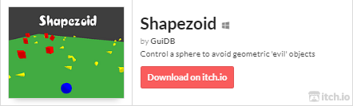
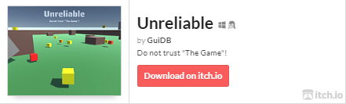
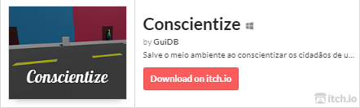
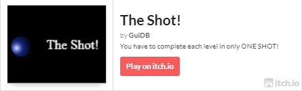
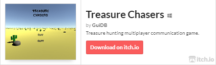

### 
Hi there 👋 I'm Guilherme, a software developer.
  
  

- 🔭 I’m currently working at Weecode  
  

- 🌱 I’m currently learning Spring Framework, ReactJS and Game Development (mainly Unity)  
  

- ❓ Ask me about anything related to Java, Javascript or Game Development  
  

- ⚡ Fun fact: I have some games published, check it out:  
  

   

  <table>
    <tr>
      <td valign="top" width="50%">
        
        
        
      </td>
      <td valign="top" width="50%">
        
        
        
      </td>
    </tr>
  </table>

   

## Connect with me  

  

  
  

   

  

 

----

Generated using <a href="https://profilinator.rishav.dev/" target="_blank">Github Profilinator</a>

